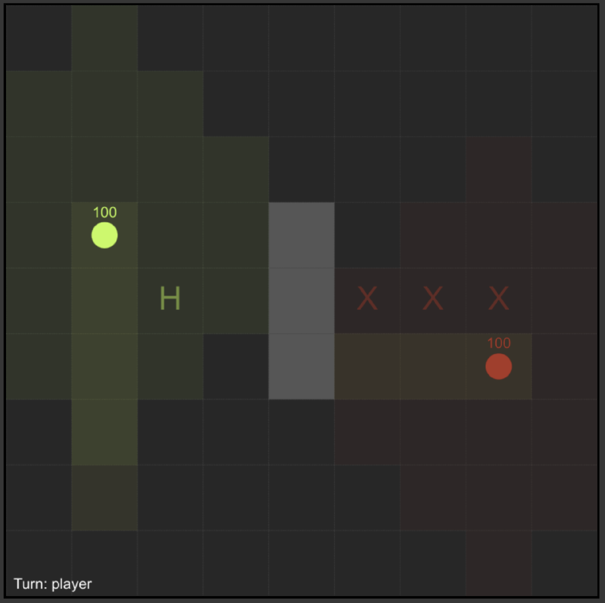

# WarGame

You are the green dot. The computer is the red dot.

Click on the map to move (you can only move a certain distance on each turn, this is denoted by faded-green tiles around your dot).

Alternatively, you may choose to change direction during a move, by pressing W/A/S/D. Your direction (and firing range) is denoted by faded-yellow tiles in front of your dot.

(i.e. you can either move or rotate on each turn, but not both)

If your opponent is in shooting range during your turn, you will automatically shoot them.

First to die loses. Good luck!

(_Note: I was being sarcastic about the "good luck" part. So far, I have personally never won a game against the computer. I think it might actually be impossible..._)

Grey tiles are walls. You cannot move or shoot through them.

'X' tiles are hazards. If you move onto one, you will take damage.

'H' tiles are health packs. If you move onto one, you will heal.

## How to play

1. Open in a browser
2. Click on the map to move or press W/A/S/D to change direction
3. Try to kill the computer before it kills you
4. Refresh the page to start over once the game ends

## Modifiying the game

There are some configuration options (map layout, initial player health, move range etc.) under the `Configuration` heading, ~line 31 in the code.
